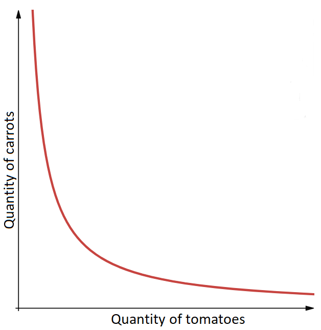
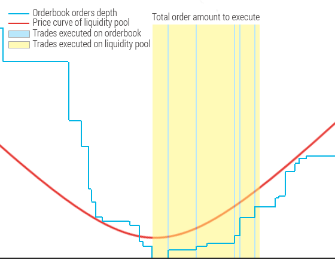

## Automated Market Makers and Liquidity Pools on Stellar Network

If someone asked me to summarize all top blockchain-related media news in 2020
in a single word it would be "DeFi". Decentralized Finance in general and
particularly automated market maker exchanges took over Ethereum like a storm.
Uniswap, Curve, Balancer, and other similar exchanges transformed the way people
trade on that platform. And if you name any other blockchain project with
turing-complete smart contracts, you can safely bet that someone has already
crafted a Uniswap-like project for it.

No wonder the Stellar community showed a strong interest in this topic.
People keep asking about something similar for Stellar.
In the [2021 roadmap](https://stellar.org/roadmap) SDF also mentioned AMMs.
The technology has been rigorously tested and it looks quite mature to implement
it on-chain. So all stars aligned – it’s time to bring automated market makers
and liquidity pools to Stellar Network.

First of all, it’s worth making a short introduction to the AMM & LP world.
Haseeb Qureshi published an [excellent post on this topic](https://medium.com/dragonfly-research/what-explains-the-rise-of-amms-7d008af1c399).
Highly recommended to anyone who wants to explore the technology more closely.
But in a nutshell, AMM is a decentralized exchange protocol that relies on a
simple mathematical formula to quote asset prices.
Unlike traditional orderbook-based exchanges, instead of trading between buyers
and sellers, users trade against a pool of tokens — a liquidity pool.
In a nutshell, a liquidity pool is a smart contract that contains funds
deposited by other users (liquidity providers).
In return for providing liquidity to the protocol, users earn fees from trades.

## Basic Concepts

To showcase this concept on a very basic example, let’s imagine that we have a
simple Farmer Market pool based on the very straightforward Uniswap formula 
`x*y=k`. Two farmers gathered 50 tomatoes and 100 carrots each for the initial
pool inventory. Let’s say they want to charge a 5% commission per trade.
People can pay tomatoes for carrots and vise versa. Initially, the formula
gives us a constant product `100*200 = 20,000` which is maintained by the AMM.
The basic price is 2 carrots for 1 tomato in this example.

Suppose someone wants to buy 2 tomatoes. Since the constant product must remain
the same after removing those tomatoes from the pool, the customer will need
to put 4.08 carrots to balance the pool and additionally 0.2 carrots as trading
fees. After the trade, our pool contains 98 tomatoes and 204.28 carrots, and the
total constant product is now 20,019.4 which is slightly greater than the
initial 20,000 thanks to charged trading fees.

Now another customer wants to buy 2 more tomatoes from our Farmer Market.
Two tomatoes will cost 4.26 carrots plus 0.21 carrots in trading fees, and the
constant sum rises to 20,040.
This demonstrates an important basic principle – as an asset in the trading pair
becomes more scarce, our AMM automatically rises its price.
At the same time, accrued fees increase the size of the pool with each trade.

The third customer needs carrots. A lot of carrots! He buys 50 carrots for
30.24 tomatoes + 1.51 in trading fees.

Ok, carrots have become quite expensive now – almost 0.81 tomatoes per carrot
which is much more expensive than the original price.
Once merchants from nearby villages discover this, they will hurry up to bring
more carrots to our AMM market up to the point when the price is more or less
balanced across all villages. That’s how arbitrage works.
So let’s suppose they delivered and traded 42 carrots+5%fee.
Our inventory now contains 202.85 carrots and 101 tomatoes.

We can draw a simple chart that shows the relation between assets price and
their quantity in the inventory (liquidity pool).

One of our farmers decides that it’s time to go home. He withdraws his share of
the inventory proportionally to his initial investment. However, now the
inventory contains more products than initially, so his 50% share equals
101.4 carrots and 50.5 tomatoes. That’s how liquidity providers make money,
and that’s why the process is called "yield farming".

What about the other farmer? He continues to provide pool liquidity (stays on
the market). But people will notice that due to reduced inventory the price
swings more significantly even on small purchases. There is a simple explanation
for this – the price slippage percentage is inversely proportional to the total
pool size. If several other farmers decide to join the Farmer Market pool, the
constant sum will increase, and, consequently, the slippage will be less significant.

How can they join? Are there any restrictions? There is one simple, but
important constraint: new pool participants have to deposit both tomatoes and
carrots in such proportion that the current price is unchanged.
For example, if someone has 30 tomatoes but only 10 carrots, he’ll need to
purchase the remaining 50 carrots either from the pool or some other market.
Of course, it’s not a requirement, he can deposit with 5 tomatoes and 10 carrots
instead.

Now you’ll wonder, does this work well for any category of goods/services? What
if people want to employ the same scheme for, say, EUR and GBP trading pair?
In order to provide the ability to exchange significant amounts of money without
a huge loss on slippage, liquidity providers will have to deposit millions to
the pool. This doesn’t sound like an awesome idea.

The solution, in this case, is to change the price quotation function to
minimize slippage when the pool is close to the equilibrium point. Here is
the StableSwap invariant employed by Curve AMM that minimizes slippage in most
cases which is ideal for fiat currencies, and of course, for stablecoins.

In the [Yield whitepaper](https://yield.is/YieldSpace.pdf) authors even
described a whole framework for defining custom invariants better suited for
certain assets, as they embed different assumptions about the price relationship
between the quoted assets.

## AMM advantages over orderbook

Probably the most important benefit of the AMM is natural liquidity
crowdsourcing. People will be happy to stake their tokens in liquidity pools
to gain a few percent of profits on their long-term holdings.
Market-making an orderbook (especially on-chain) is quite tricky.
Automated bots like Kelp considerably simplify the process, but it’s still a
risky business. At the same time, liquidity pools work incredibly
straightforward – just deposit tokens and come back in a few months to withdraw
your stake with profits. No need to worry about the bot management, its hosting,
periodical strategy tuning. This explains the explosive growth of funds locked
in various Ethereum liquidity pools. I do think that introducing such a feature
on Stellar mainnet will attract ten times more liquidity to Stellar DEX.

AMMs are absolutely straightforward by nature. Liquidity pools don’t store any
complex information and work completely deterministically. With such dead simple
liquidity provisioning, it’s much easier to attract liquidity to the markets
from regular users. Not to mention that there are no inherent costs, unlike with
corporate market makers who often require additional payments for their services.

Asset issuers don’t need to wait until the token attracts a critical mass of
users. They can start making several trading pairs with a newly issued asset by
merely depositing tokens to the pool or engaging community users to provision
liquidity. This will certainly simplify the process of starting a new project on
Stellar, as well as provide a powerful marketing flywheel for early-stage tokens.

The very concept of AMMs implies that no third-party company holds user funds
at any point and the algorithm itself doesn’t require any external data.
Everything is happening on-chain, so potential regulatory risks are very
limited compared to the classic exchange design.

## AMM on Stellar Network

Given all mentioned above, having AMM and liquidity pools on Stellar looks very
promising, especially if this logic is implemented on the protocol level.
On Ethereum blockchain dozens of AMM projects compete for users with each other
and oldschool orderbook-based DEXes. As a result, the liquidity scattered across
the ecosystem. No wonder that "liquidity aggregators" (engines that compare
prices and can execute an order using several different liquidity pools and
decentralized exchanges) emerged and became the most convenient way to buy/sell
tokens without diving into the mind-blowing zoo of smart contracts with diverse
architecture and execution logic.

AMM implemented on the protocol level will consolidate the liquidity, providing
better exchange prices and lower slippage compared to a bunch of AMMs built with
smart-contracts. Sounds like an awesome idea that brings a lot of new benefits
to Stellar users. But would it be an ideal solution?

First of all, the new AMM interface requires new trading operations.
In addition to the existing `ManageSellOfferOp` and `ManageBuyOfferOp`, we’ll
have to add `SwapSellOp` and `SwapBuyOp` for the interaction with AMM.
If we want to enable path payments on top of AMM, another two operations pop up:
`SwapPathPaymentStrictReceiveOp` and `SwapPathPaymentStrictSendOp`.

The trading process becomes confusing for regular users. Which trade should one
choose? What’s the difference between an order and a swap? How to get the best
rate? Of course, wallets and exchange interfaces should come to the rescue,
providing hints in the interface and maybe even aggregating price feed across
the liquidity pool and orderbook for a given assets pair to ensure the best
possible exchange price. That’s feasible, but not very user-friendly and may
lead to confusion.

Already existing problem with a huge number of bots spamming the ledger while
competing for arbitrage opportunities widens considerably given that AMMs rely
on arbitrage actors that rebalance pools if the price on the AMM floats too far
from global market prices. This presents much more profitable opportunities than
doing circular path payments for several ordebook trading pairs.

Token issuers have to subsidize cash for both the liquidity pool and DEX
orderbook if they want to provide support for the initial token price action.
This kind of eliminates the marketmaker-related advantages I described earlier.

Detailed analysis of this problem provides the only simple answer that allows us
to overcome most of the problems described in this section, as well as other
potential problems not mentioned here. We need to combine both approaches on the
core matching engine level.

## Orderbook + AMM

One of the strongest selling points of Stellar on-chain DEX is a concept of
concentrated liquidity which also powers the mechanism of path payments.
So what if we could build a matching engine that executes orders using both
the existing DEX orderbook and AMM liquidity pool? Without any doubt,
such fusion of advantages of both approaches backed by readily available
compound liquidity provides a truly unique set of features.
As far as I’m aware, no other blockchain can offer similar functionality at
the moment. The aforementioned multiparadigm DEX can be implemented using
elementary iterative order execution.

The basic idea behind this algorithm is very simple. When a new (taker) order
arrives, the DEX engine loads the current state of the liquidity pool for the
traded asset pair, fetches available cross orders (maker orders) from the
orderbook, and iterates through the fetched orders. On every step, it checks
whether the next maker order crosses the price of the taker order.
Before maker order execution the engine estimates the number of tokens that can
be traded using a liquidity pool up to the price of the current maker order and
executes the trade on the pool if possible. After that, the current order itself
is matched to the remaining taker order amount, and so on, up to the point when
a taker order is executed in full. If the outstanding amount can’t be executed
on the orderbook nor the pool, a new order with the remaining amount is created
on the orderbook.

Let’s analyze the following example. Suppose we want to buy 300 USD for XLM.
We have a simple Uniswap-like AMM with a liquidity pool containing 20,000USD and
40,000XLM (for the sake of simplicity we can omit liquidity pool trading fees
here). So AMM equilibrium price is 2 XLM/USD. And the orderbook contains several
sell orders:

- Sell 15 USD at 2.02 XLM/USD
- Sell 40 USD at 2.025 XLM/USD
- Sell 700 USD at 2.03 XLM/USD

Following the step function algorithm described above, our matching engine
should execute the following trades:

1. Current AMM price is lower than the best orderbook offer - buy a portion of
   USD tokens from the liquidity pool up to the price 2.02 XLM/USD. Uniswap
   invariant gives us a quote to buy 99.26 USD for 199.50 XLM.
2. Then we can execute the offer from the orderbook - buy 15 USD for 30.3 XLM
   at 2.02 XLM/USD.
3. The next order is at 2.025, so we buy the next portion from AMM - buy
   24.58 USD for 49.72 XLM.
4. Execute the orderbook offer - buy 40 USD for 81 XLM at 2.025 XLM/USD.
5. Again buy 24.49 USD for 49.66 XLM at 2.03 XLM/USD from AMM.
6. Execute the rest of the taker order on the orderbook - buy 96.67 USD for
   196.24 XLM at 2.03 XLM/USD.

The calculated resulting price is 2.0214 XLM/USD. If we execute the same
300 USD order on the orderbook only, this gives a price of 2.0288 XLM/USD.
Correspondingly, AMM-only order execution can offer only 2.0614 XLM/USD.
The benefits of the combined model are pretty evident in this case.

On one hand, this approach provides a familiar exchange experience in
combination with the ability to have on-chain maker orders. On the other hand,
it fully incorporates all benefits of automated market makers with shared
liquidity pools, at the same time hiding the underlying technical details
from end-users. Users always get the best possible exchange price with the
proposed architecture. No other solution can offer this truly important benefit.

Even an elaborate external liquidity aggregator app that potentially can analyze
all prices and execute part of the trade on the orderbook and the other part on
the liquidity pool will be able to provide the same exchange rate in the
best-case scenario. However, in the real world, this won’t be the case due to
extra transaction fees (separate order execution implies at least two operations
instead of one and respectively x2 tx fees) and the non-deterministic nature of
the on-chain DEX. There is no guarantee that both the orderbook and AMM will be
in the same state predicted by the liquidity aggregator as any new trade shifts
prices. Therefore, the proposed concept provides superior liquidity in
comparison with any other possible approach while entirely eliminating the need
for arbitrage traders for the AMM rebalancing.

Why hasn't this dual concept been implemented yet, if it’s really so cool?
Of course, this seemingly elementary idea entails a huge amount of technical
questions. For example, how liquidity pools are created, how pathfinding should
work for path payments, are there any restrictions on the min deposit size, how
can this be stored on-chain? We need to figure out a lot of things before moving
to the implementation itself.

This process will take some time, so I decided to publish this intro to kick off
the discussion while we analyze all implementation details with Stellar Core
developers to compose a draft technical specification.
