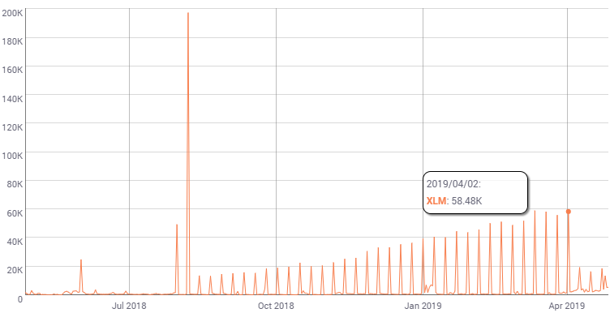
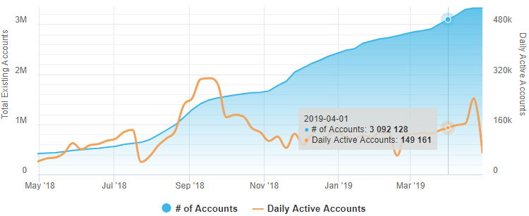
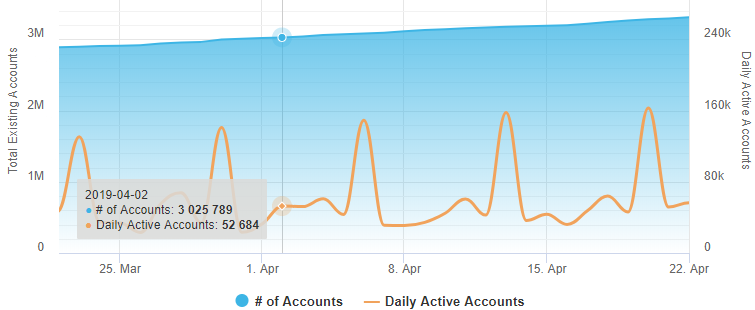
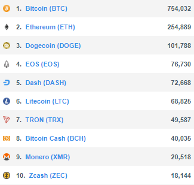

> "99 percent of all statistics only tell 49 percent of the story." – Ron DeLegge II.

The question about the real number of active accounts in Stellar Network surfaced numerous times on Twitter and Reddit discussions. "Crypto Experts" often compare different blockchains by Daily Active Address (DAA) metric and tend to make vague assumptions about the real-world adoption based on it. DAA is usually calculated as a total number of unique accounts/addresses that participated in blockchain transactions during the past 24 hours. While the correlation between the DAA and adoption may be questionable, yet this metric is important for determining the actual "liveness" of the blockchain.

So what about the Stellar Network DAA? Here is what [CoinMetrics.io](https://coinmetrics.io/charts/#assets=xlm_log=false_left=activeAddresses_zoom=1524787200000,1556323200000) (one of the most reputable cross-chain statatistics aggregation services) shows:

It doesn’t look particularly impressive. The chart shows miserable 13K accounts daily at the time of writing, or about 0.4% of all existing accounts. Even during the last activity spike at the beginning of April, the maximum DAA was only 58K. Periodic fluctuations that can be seen across the chart most likely are caused by the weekly inflation payouts.

Let’s examine this data more closely. CoinMetrics states:

> "Active addresses is the number of unique sending and receiving addresses participating in transactions on the given day."

The exact computation methodology adopted by CoinMetrics is behind the scene, so we don’t really know which operations are considered "valid" and which are ignored in this case.

* First of all, we can see that this definition is more relevant to the UTXO model and entirely focused on payments. But what about other operation/transaction types? Can we say that "account is active" when it updates its own settings, submits an order, or executes a path payment on Stellar Network? Yes, without any doubts. We can’t just ignore such operations.
* Unlike many other blockchain projects, Stellar defines a transaction rather as a container for operations. A single transaction can contain up to 100 operations. Moreover, each operation may have a different source account (a "sender" in case of regular payments). It provides the ability to build complex contracts and use so-called channel accounts. Therefore, we should also check an origin address for each operation within a transaction, not only a "source" account, specified on the transaction level.
* Also, the "receiving addresses" bit in the CoinMetrics’ definition looks suspicious. The receiving party, in fact, is a "passive" address, not an active one. For example, a wallet used by BTC miner will be treated as "active" when it receives the mining reward from the pool according to this definition, despite the fact that the owner didn’t even log into the wallet during the last year. It would be fair to exclude the destination accounts from this metric.

Here is what we got from the raw Stellar history data:

Let’s zoom in to view the activity during the last action spike recorded by CoinMetrics on 2019-04-02:

As we can see, it’s not a spike at all. In fact, the value is closer to the baseline. It’s even smaller than the value reported by CoinMetrics, as we excluded destination accounts from our DAA metric.

From the chart we can see that the metric regularly crosses the 150K line, hence we can safely tell that **~4%** of all Stellar accounts are active. And returning back to the large-scale chart, we can spot a record activity. Back in September 2018, DAA reached **304K** or **21.5%** of all existing Stellar accounts at the moment.

Here are the Top-10 blockchains ranked by DAA value according to [Messari OnChainFx](https://messari.io/onchainfx) (the data is provided by CoinMetrics).   
Assuming that statistics for Bitcoin and Ethereum are calculated correctly, Stellar should be ranked much higher (currently it’s on the 11th position).

CoinMetrics did not bother to answer my email and Twitter messages, so I can’t say for sure whether it’s an unintentional data misinterpretation or deliberate statistic manipulations. In any case, users are free to make their own judgments and examine Stellar Daily Active Account metric chart built accordingly to the approach described in this post. It will be available in the upcoming [StellarExpert](https://stellar.expert/) release by the end of the week.