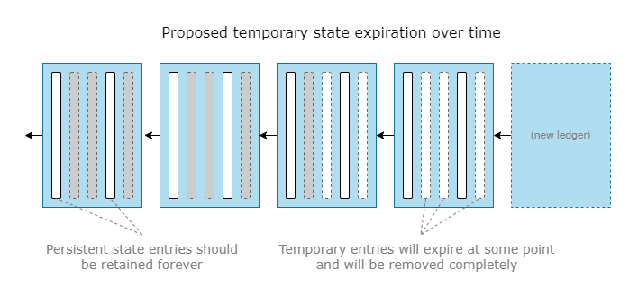
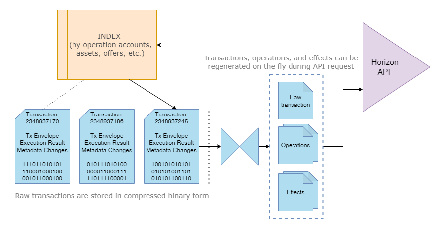
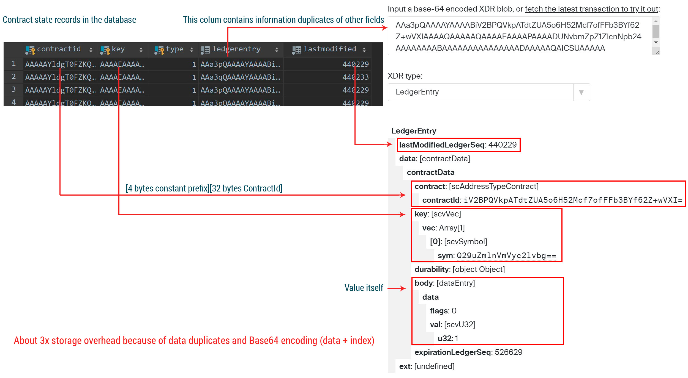
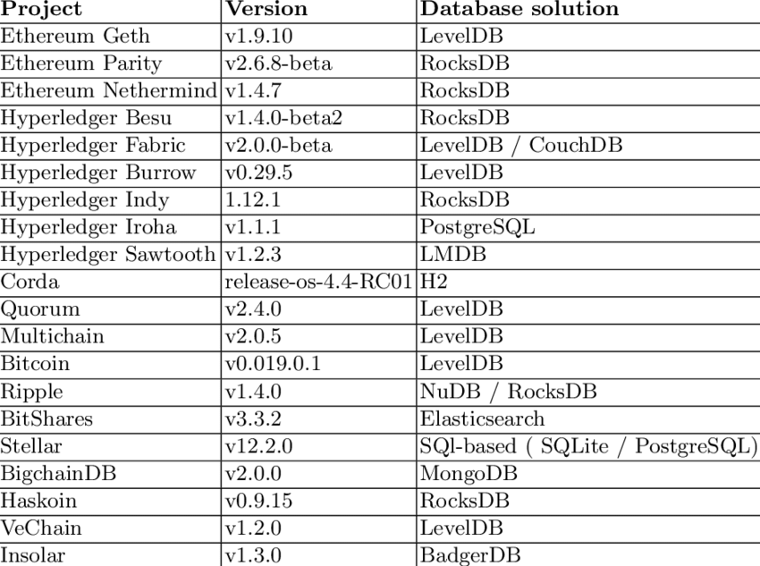

> This blogpost represents a simplified and trimmed analysis covering some problems of technical decisions embraced by SDF developers. 
Subordinate details and particulars intentionally omitted in favor of making the text more accessible to wider public.

## State expiration concept

First of all, a short intro.
[Horizon server](https://developers.stellar.org/api/horizon) is a REST API backend software that provides comprehensive API access to
the current Stellar blockchain state and transactions history. SDF developers proposed a partial Horizon history retention approach
a while ago to address the problem of the overblown database size, which grows exponentially with time.
Basically, the idea is to discard old transaction history and provide access to only recent history entries.

[State expiration](https://soroban.stellar.org/docs/fundamentals-and-concepts/state-expiration) is a concept that was born with the
Soroban smart contracts engine. In a nutshell, it means that all data entries written by the smart contracts will eventually expire,
and will be removed from the blockchain unless someone periodically "bumps" this record by paying additional fee for data retention
on-chain.

Why such state expiration implementation might be a bad idea?

- There’s no way to make data persistent. It will expire and will be deleted unless bumped.
- The maximum allowed extension period is 1 year.
- Some kind of third-party service is required to track and store evicted state entries, or they vanish forever.
- Smart contract developers may forget to bump contract-dependent state entries or abandon the protocol, which may result in devastating
  consequences for users of their smart contract.

What’s wrong with partial history?

- Only recent transactions will be readily available to client apps through a familiar API intraface.
- Access to trimmed history (e.g. older than 1 year) will require an external history service, with much higher latency, and probably for an
  extra fee.
- Wallets relying on Horizon, won't be able to show any operations history for accounts that have no recent activity.

### Implications

- User data, e.g. balance records in AMM or lending protocol, will expire and disappear unless monitored by certain third-party services.
- Displaying evicted account balances becomes a challenging task for wallets.
- To recover an evicted entry, a separate transaction is required.
- Since old transaction history entries are not available in Horizon, recreating expired state from historical transaction footprints also
  looks non-trivial.
- To "resurrect" expired entries, a user has to rely on off-chain applications/services, paying some money for the recovery.
- Evict/recreate operations, as well as periodical expiration bumps, consume a substantial portion of ledger capacity and generate
  non-productive consensus load.

From a broader perspective, the real question is how far this diverts us from the original blockchain idea? While Stellar will still have
blocks and operational state, there will be no guarantee that the data is stored in either place. Of course, it still can be retrieved
from validator archives that contain entire compressed history of transactions and applied state changes, but at this point there is no
tooling for this. Such an approach hugely complicates access to the data for developers and users alike while increasing the role of
third-party centralized services.

## Suggestions

### Allow persistent storage fo contracts state

In the current implementation there are 3 storage classes (`instance`, `persistent`, and `temporary`) plus two
operations: `RestoreFootprintOp` and `BumpFootprintExpirationOp`. Despite the name, neither of the storage classes offer a truly persistent
storage, all of them may be evicted at some point in time.

With a slightly modified approach, state expiration might be quite beneficial for everyone. We really only need two storage classes:
`permanent` (state data is **never** evicted) and `temporary` (with limited lifetime configured upon creation).

Creating permanent state entry should cost more than writing to the temporary storage, e.g. 1XLM + fee proportional to the stored data size.
To balance very expensive entries creation, updates to these permanent state entries should be less expensive since the user has already
paid for the persistent state slot reservation. On the other hand, fees charged upon creation of temporary storage entry might be much
lower, proportional to the desired lifetime of this entry. In this case, there’s no need for any additional operations and the very concept
of expired state bumping or voodoo manipulations with ledger entries revival. Naturally, developers will be incentivised to utilize
temporary entries whenever possible.

### Optimize binary data storage and indexing strategy

Fully-ingested Horizon history database has such tremendous size mainly because of the suboptimal storage strategy. It contains a lot of
duplicate information. In fact, effects, operations, and transaction details can be retrieved from the raw transaction XDR. There is no need
to save all this data, only raw transaction data (envelope, result, and meta XDR entries) plus the index containing search associations (
accounts, assets, offers that were modified by a given transaction) is required.

Everything else can be reconstructed from the raw XDR on the fly in response to the API request. This essentially means about 60%+ size
reduction for the Horizon database. Further on, the data can be compressed. For example, binary XDR data stored in the StellarCore database
as Base64-encoded text, which consumes at least 33% more space than raw binary data. Adopting a performant compression algorithm can reduce
it by another 40-80% depending on particular transaction contents and modifications being made to the ledger state.

For example, StellarExpert database containing the entire Stellar pubnet history is currently 3.3TB in size (it also contains all failed
transactions), plus 1TB of the ElasticSearch index for operation-transaction mappings. Significantly smaller than Horizon database. 
Thus, it has lower hardware requirements and generates much less read/write IO.

### Adopt better state warehousing approach

Current Stellar Core database storage format presents a major performance bottleneck for contract state warehousing.  not to mention that the implementation itself is
inefficient because it has about 3x overhead over the actual record size. In the "contractdata" table LedgerEntry, Contract ID, and
state record key itself all stored in Base64 format, while the serialized LedgerEntry XDR contains all other fields.

If we are talking about PostgreSQL, bytea binary column data format is much more suitable for this. Contract id, state key, and type can be
stored in a single column with 64 bytes length as [contract_id][sha256hash(key, type)]. This is a more efficient way to save and query data
because it allows to select records based on the prefixed search (ability to query all records for a given contract id using standard SQL
operators) while maintaining a predictable column and index size under any circumstances. All other data from the ledgerentry column (body,
last modified) can be stored either as separate columns or in a serialized binary structure, which can be also stored in the bytea format
with compression. Smaller size of data and indexes means higher throughput for transactions and more relaxed hardware requirements for
validators.

### Look for better database options

From a broader perspective, PostgreSQL itself is not very well suited for blockchains. For good reason many other blockchain projects rely
on highly optimized in-process database engines like LevelDB and RocksDB. Both provide very high IO throughput, have built-in versatile
indexing strategies, and allow efficient Merkle hashing. "In-process" part is crucial here since working with a built-in database rules out
all inter-process communication between DB engine and Stellar Core processes, data serialization/deserialization, SQL parsing, connections
management, and auxiliary background DB maintenance processes.

([research link](https://www.researchgate.net/publication/342941591_A_Brief_Review_of_Database_Solutions_Used_within_Blockchain_Platforms))

Stellar also slowly drifts in this direction with the LevelDB-based solution for buckets data presented last year. A logical next step would
be to store operational ledger state as well as history in the same BucketsDB, achieving data deduplication of entries (PostgreSQL DB stores
entries state which is also stored in buckets). This step will not only save space, but also hugely increase read/write performance,
eliminating current bottlenecks.

### Prioritizing long-term goals

The state expiration concept proposed by SDF developers looks flawless from the technical point of view. Truly elegant ideas,
which nevertheless will have a long-lasting compounding negative impact. In this particular case, comfort, ease-of-use, reliance
for end-users and developers alike are obviously at odds with interim performance benefits for validators. Current state management
approach will not eliminate the need to change the database/storage strategy in the long run, so is it really a worthy venture?