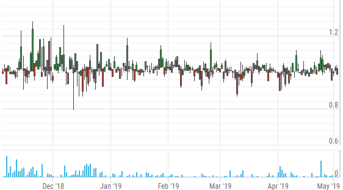
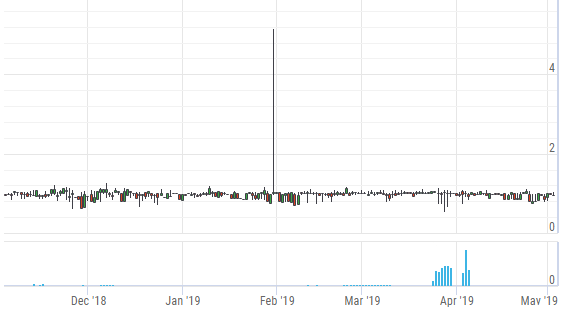
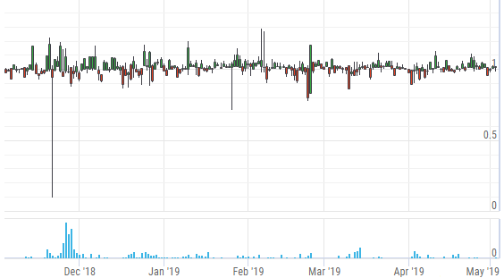
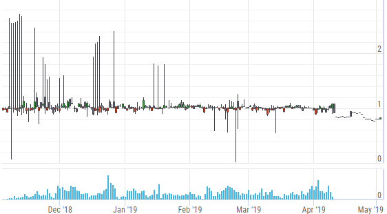
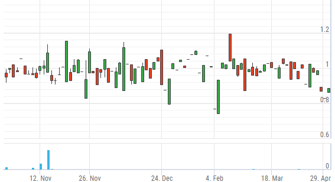
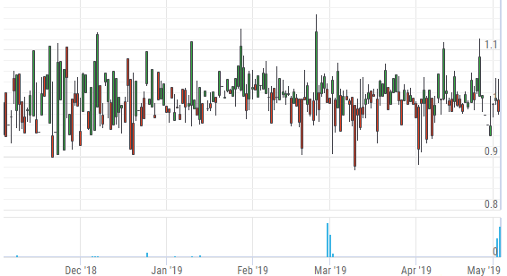

"Stablecoin" is a buzz-word of all recent blockchain-related events. Exchanges, banks, gold-mining companies – seems like hundreds of companies worldwide have issued their own fiat-pegged or resource-based tokens. Currently, most Stellar-based stablecoins are traded only on Stellar DEX. Sometimes it’s quite hard to determine the value of such tokens, as they are not traded directly against their fiat equivalents. In order to determine the actual price of a token, we need to derive that value from {token}/XLM market and current XLM/USD price. Since every trade is recorded on the ledger, we have a track of all recent trades on Stellar DEX. And we can use data gathered by exchange aggregators like CoinGecko to retrieve the historical XLM/USD price. Market-makers themselves use similar methods to determine the price and provide liquidity for their tokens.

We’ll use two additional parameters to estimate the volatility:

* _Standard deviation_, widely used statistical measure of price volatility, measuring how widely prices are dispersed from the average price.
* _Yang-Zhang volatility_, a more advanced historical volatility estimator that has a minimum estimation error, is independent of the drift, and independent of opening gaps.

Let’s analyze top USD-pegged stablecoins by asset holders and trades volume. Of course, there are other fiat-backed stablecoins for EUR, GBP, AUD, etc. However, we’ll publish a separate study featuring those tokens, as measuring volatility for, say, EUR-backed tokens against the USD equivalent doesn’t look like a good idea.

### AnchorUSD USD

Total supply: **765,404 USD**  
Trustlines: **2,116**  
Total trades count: **14,396**  
Current price: **0.994 USD**  
Standard price deviation: **3.28%**  
Yang-Zhang volatility: **1.34%**

### WhiteStandard WSD

Total supply: **1,219,921 WSD**  
Trustlines: **11,742**  
Total trades count: **166,927**  
Current price: **0.953 USD**  
Standard price deviation: **4.93%**  
Yang-Zhang volatility: **17.05%**

### Token.io USD

Total supply: **999,700 USD**  
Trustlines: **653**  
Total trades count: **138,530**  
Current price: **0.988 USD**  
Standard price deviation: **3.59%**  
Yang-Zhang volatility: **2.39%**

### Stronghold USD (service terminated)

Total supply: **0 USD**  
Trustlines: **1,165**  
Total trades count: **1,019,640**  
Current price: **0.809 USD**  
Standard price deviation: **6.08%**  
Yang-Zhang volatility: **118.69%**

### BitboxOne USDT

Total supply: **100,000 USDT**  
Trustlines: **127**  
Total trades count: **4,092**  
Current price: **0.891 USD**  
Standard price deviation: **5.08%**  
Yang-Zhang volatility: **12.03%**

### Funtracker.site USD

Total supply: **5,001 USD**  
Trustlines: **91**  
Total trades count: **6,038**  
Current price: **0.989 USD**  
Standard price deviation: **3.28%**  
Yang-Zhang volatility: **1.36%**

_All mentioned asset technical indicators and charts can be found [here](https://preview.stellar.expert/explorer/public). The main purpose of this short study was to explore the price volatility of USD-backed tokens issued on Stellar. It’s not an endorsement or trading advice._