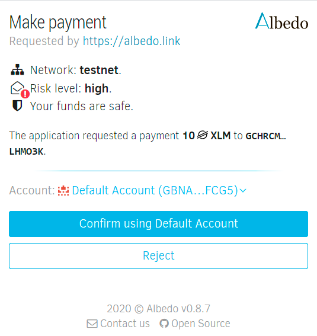
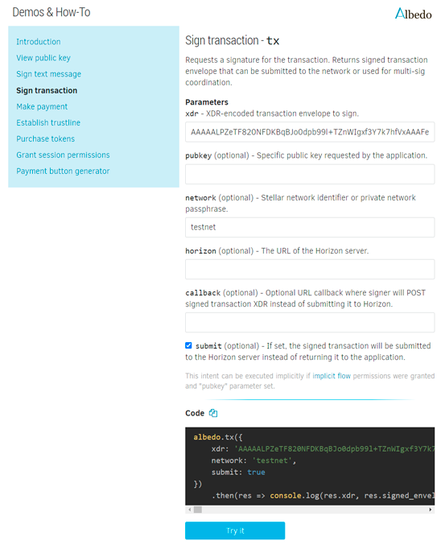

Two years, five pivotal architecture revisions, hundreds of discussions,
countless coding hours, plus a secret ingredient - invaluable feedback from
brilliant SDF Stellar ecosystem developers.
Truly long and bumpy road from the delegated signer prototype
[published](https://galactictalk.org/d/1192-stellarexpert-id-single-sign-on-app-and-tx-signer-for-stellar-network)
back in 2018 to the production-ready app.
And finally, meet [Albedo](https://albedo.link) – a security-centric,
developer-friendly, and at the same time, easy-to-use delegated signer for
Stellar Network.
Something I can be absolutely proud of, even despite the fact that it took
ten times more effort than I initially  expected. So let me explain a bit 
why I'm so excited about this particular project.

## Intro

Albedo provides a safe and reliable way to use your Stellar account without
trusting anyone with a secret key.

It is not a wallet. It's a keystore web app and browser extension (currently
available for [Chrome](https://chrome.google.com/webstore/detail/kbojmmmibkfijmjgnfgfpngmmgkkpncl)
and [Firefox](https://addons.mozilla.org/en-US/firefox/addon/albedo-signer-for-stellar/)).
Think of it as a bridge for other applications which allows them to ask permission
to sign a transaction or verify identity on the user's behalf so that the same
account can be used across the whole universe of Stellar applications.
People kept asking about Metamask for Stellar, and here it is – with a slightly
different interface, yet packed with unique features.

But there are dozens of existing Stellar wallets out there, why invent yet
another one?

First of all, creating a new account each time you want to check a shiny new
promising app, wallet, or trading interface may be quite exhaustive. 
Things like
[SEP-7](https://github.com/stellar/stellar-protocol/blob/master/ecosystem/sep-0007.md)
were intended to deal with the problem, but the protocol
used is far from perfection (after working for a while with this standard,
I can write a separate long read article on shortcomings of such an approach). 
Just like "Sign in with Google" button allows you to log in and authorize
actions for all services and third-party websites that support Google OAuth,
Albedo was designed to be the single access point to the multitude of Stellar
apps over a unified protocol. 


Furthermore, each wallet wants direct access to your secret key. 
And who knows how they are going to store and protect it?
What if hackers take over the server and drain funds from all accounts?
Sad story, and it happened before.

We've done everything possible to reach the maximum keystore security.
Secret keys are encrypted with your password and safely stored in the browser.
Of course, it's not a hardware wallet, but I'm quite sure Albedo might be 
one of the safest options for storing keys in the browser.

Sensitive data never leaves your computer/smartphone, never
transmitted over the network, never stored on remote servers,
so no one has access to your secret key, even us. 
Internally, the browser provides a protected sandbox preventing other tabs
or external websites from accessing user's data. Why it's important? 
Because it means that we eliminate the most dangerous vector of wallet attacks,
mitigating a risk that attackers can gain control over all stored
accounts after only one successful server hack.



Another ultimate objective we were trying to achieve (and I think we 
definitely reached this goal) is to simplify the development of Stellar apps. 
From the developer's perspective, it takes only a few lines of code to turn
any website into a production-ready Stellar wallet.
 
Transactions building, signing, validation, error handling – we have everything
covered. There is no need to implement a keystore, build a dozen interfaces for
transaction processing, and worry about security. In fact, things like payment
requests can be implemented without any coding at all, therefore allowing instant
"stellarization" of any marketplace or even a basic WordPress site by simply
copy-pasting code produced by the 
[payment request generator](https://albedo.link/playground#payment-request).

At the same time, Albedo provides a set of low-level tools for working with
complex multi-sig schemes, making it a perfect match for advanced Stellar-based
applications and smart-contracts.



## All features at a glance

  
**Secure key management**  
Secret keys never sent over the Internet and never exposed to third-party
services.

    
**Secure transaction signing**  
Robust protection backed by isolated transactions signing inside the browser
sandbox.

  
**Web apps Single Sign-On**  
Log into third-party websites with your Stellar account, just like with
Google/Facebook OAuth.

  
**Multi-account support**  
Use multiple accounts, as well as hardware wallets, and switch them on the fly.

  
**Trustlines creation**  
Create anchor trustlines and participate in token airdrops in one click.

  
**Works everywhere**  
Seamless experience across different browsers and operating systems,
desktops and smartphones.

  
**SEP-0007 compatible**  
Handles "web+stellar" links – wider support for different Stellar ecosystem
services.

  
**Universal account**  
Expand the reach of your app and forget about on-boarding. Every Stellar user
is your user now. We'll take care of all account-related things.

  
**Instant jumpstart**  
No need to create yet another keystore and transactions processing pipeline.
Focus on what really matters for your app while saving months of work on
trivial things.

  
**Powerful abstraction layer**  
Albedo handles all low-level details (transaction building, signing, multi-sig,
validation, error processing) while providing a streamlined API interface.

  
**Signing multi-tool**  
Multiple signing option – Albedo accounts, hardware wallets, direct secret
key input, SEP-0007 links. Complex logic is hidden from the caller app
behind the unified generic interface.

  
**Easy to integrate**  
A single lightweight JS package, no other dependencies, works out of the box
in any modern browser – desktop or mobile.

  
**Enhanced security**  
Security-first approach with a client-side encrypted keystore,
fully sandboxed environment, and proven cryptography.

  
**Effortless ICO and airdrops**  
Setup tokensales and airdrop claim forms in minutes. Selling your asset on DEX?
Embed a tiny script into your website, and you are good to go.

  
**Public-key cryptography**  
Build custom authentication or notary schemes with arbitrary data signing
and verification tools using Stellar keypairs.

## More magic on the way

In addition to the functionality mentioned above, we are also preparing
several other exciting updates. 

An extended transaction validation is at the top of our priorities list. 
Currently, the verification before sending a tx to the Horizon is one of the
most annoying problems for wallets. And it is certainly not as straightforward
as it might look. A good wallet must check everything: Stellar addresses,
sequence number, fees, trustlines, existing DEX offers, even things like
sufficient authorization for multisig accounts. It might not be problematic
when a wallet builds a transaction right before sending it to the network, 
but everything becomes much more complicated when it comes to the pre-signed,
multi-account transactions, or smart contracts.
 
Currently, we identified 46 different potential error cases starting from
trivial (like a non-existing source/destination account) and ending with tricky
situations – too many signatures, trustline limit exceeded, trustline not
revocable, etc.

Our main goal here is to provide a comprehensive automatic validation for
incoming transactions. It makes life much easier for both a user and app
developer. Users don't need to worry whether a transaction will come
through. On the other hand, developers can go ahead with very basic validation
on their side as Albedo will automatically check everything and return a
specific error description back to the app.

Besides that, we are working on federation addresses support, new multisig
aggregation service, built-in KYC information provider, and, of course,
interface improvements to make the user experience even more streamlined and
user-friendly.

## Where to start

That's probably evident enough from this announcement itself, but I'd like to
point out that Albedo is an infrastructure project in the first place, and this
is mostly a developer-oriented post.

If you already build things on Stellar or want to give it a try but don't know
how to start, then check our [playground](https://albedo.link/playground)
where you can experiment with a declarative approach to submitting Stellar
transactions.
For instance, here is what you can do without even installing StellarSDK:

```js
//import tiny interface library
import albedo from '@albedo-link/intent'

//request user's account address
albedo.publicKey()
    .then(res => console.log('Public key: ' + res.pubkey))

//pay 15 EURT tokens to account GDD4…TQHQ with memo "congrats!"
albedo.pay({
    amount: '15',
    destination: 'GDD46J3TMNU5L7NCI6CHDJHPKW4QK2LFKRYDOHTTKV67RLT3GAQWTQHQ',
    asset_code: 'EURT',
    asset_issuer: 'GAP5LETOV6YIE62YAM56STDANPRDO7ZFDBGSNHJQIYGGKSMOZAHOOS2S',
    memo: 'congrats!',
    submit: true
})
    .then(res => console.log('Success'))

//prepare and sign a transaction to buy 0.1 BTC
albedo.exchange({
    sell_asset_code: 'USD',
    sell_asset_issuer: 'GDUKMGUGDZQK6YHYA5Z6AY2G4XDSZPSZ3SW5UN3ARVMO6QSRDWP5YLEX',
    buy_asset_code: 'BTC',
    buy_asset_issuer: 'GAUTUYY2THLF7SGITDFMXJVYH3LHDSMGEAKSBU267M2K7A3W543CKUEF',
    amount: '0.1',
    max_price: '1000'
})
    .then(res => console.log(res.signed_envelope_xdr)) 

//request user's signature of arbitrary data
albedo.signMessage({
    message: 'Notary approval'
})
    .then(res => console.log(res.pubkey, res.message, res.message_signature))
```

At the same time, for regular users, Albedo will be
of little use at the moment because it hasn't been integrated anywhere yet. 
During the past few months, we've been actively discussing it with SDF and
ecosystem devs to ensure that Albedo is robust and ready for production usage.
As a side result of this peer review, we have preliminary agreements,
so in the nearest future you'll see a bunch of wallets, trading services,
and various apps utilizing Albedo API.

Stay tuned for our upcoming announcements and blog posts. Also, we will be
grateful for any feedback. And if you spot any issues, please submit a 
[bug report](https://github.com/stellar-expert/albedo/issues).
