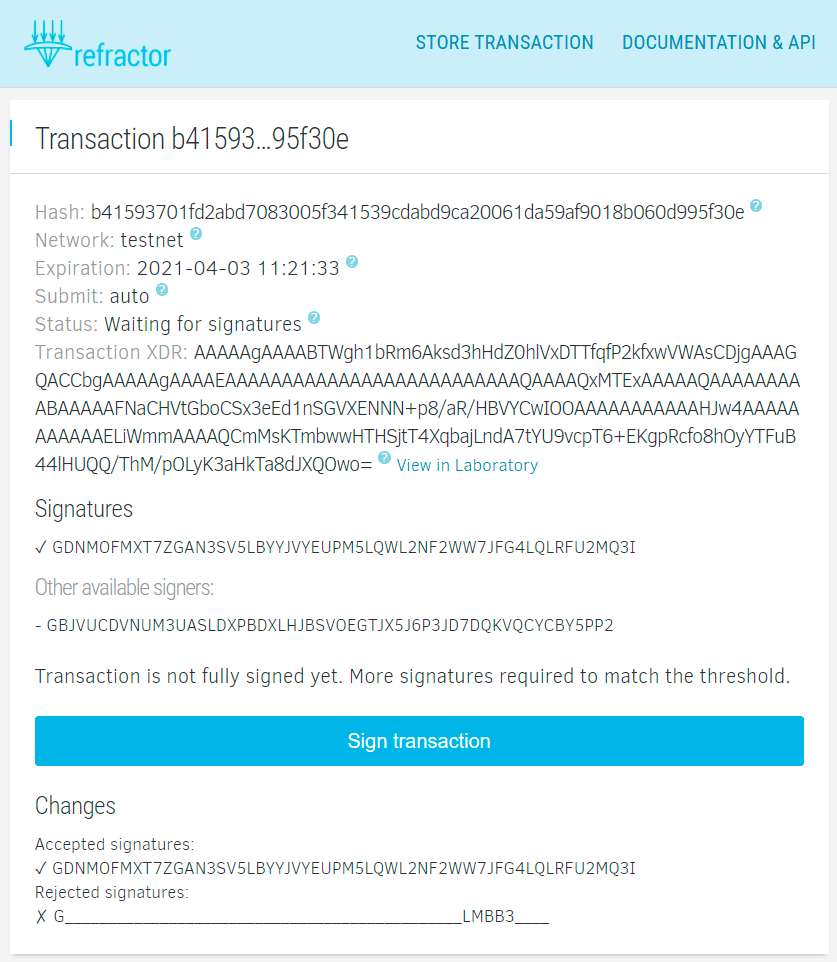

Multisignature, a seemingly simple concept that requires a transaction to have
two or more signatures before it can be executed, is a mighty magic wand in the
blockchain world. It is widely used to manage joint funds, organize escrow
transactions, and protect custodial wallets. For Stellar Network multisig is
particularly important since it serves as one of the basic components that
powers smart contract capabilities.

Most of the projects offering smart contracts logic imply that some pre-signed
or partially signed transactions should be stored by a user for a prolonged
period of time. For obvious reasons, a service provider can’t be regarded as a
trustworthy custodian in this situation (otherwise, it’s not a trustless
solution at all). At the same time, storing pre-signed transactions on the
client-side is not an option as well due to the high risk of losing this
transaction which in turn may result in a permanent funds lock. There is no
standard solution for this problem, so developers have to spend months
reinventing the wheel or even simply sacrifice security altogether.

After distilling years of Stellar apps building experience and feedback from
dozens of ecosystem developers, we are happy to introduce 
[Refractor](https://refractor.stellar.expert/) – pending
transactions storage and multisig aggregator for Stellar Network.

Need a place to keep your transaction until all signatures are in place?
[Store it here](https://refractor.stellar.expert/tx/add),
this is completely free.

Refractor is a developer-focused service in the first place, but anyone can use
it to store transactions and gather signatures required to match the signing
threshold. You can set the network (Stellar public network or testnet),
expiration date, custom callback URL. Any eligible signer can sign the
transaction. As soon as it reaches the required threshold (calculated
automatically), the service either submits the transaction to Stellar network
or executes a callback.

Once uploaded to the server, the transaction cannot be deleted or modified.
Other services and wallets can access and sign it by a standard URL like
`https://api.refractor.stellar.expert/tx/4b50...3dad` where its hash serves as
a unique identifier. Alternatively, a person who uploaded the transaction can
share a direct web link (e.g. `https://refractor.stellar.expert/tx/4b50...3dad`)
pointing to a page where other people can sign the transaction using
a convenient Albedo web interface. The website shows information about current
signing status, suitable signers, and thresholds.

Refractor automatically discovers potential signers and computes the thresholds.
The signing process is fully coordinated, signatures aggregation occurs on the
server-side which in turn allows us to deal with potentially problematic cases
like applying signatures from two different signers concurrently or preventing
handling `TX_BAD_AUTH_EXTRA` errors in case of too many signatures applied to a
transaction. Refractor ensures that signatures are valid and consistent.

This service may come in handy for anyone working on Stellar multisig-based
solutions, namely joint custodial account operations, secure asset issuing
account management, escrow services, financial derivative contracts trading
(features, options), p2p lending, insurance, etc.

Please bear in mind that the service is in the public beta, and it may
contain errors. Currently, we still gather feature requests from developers.
API interface, as well as the storage format itself, is subject to changes.
We use redundant storage, so transactions submitted to the system are very
unlikely to get lost but we cannot offer 100% retention guarantees until the
API and all formats are finalized.

Refractor is not suitable for storing transactions containing any potentially
sensitive information as anyone with the link will be able to view transaction
details on the site. For example, this may lead to the potential front-running
of trades involving derivatives.

Currently, the service is configured to work in auto-discovery mode only, which
means that it automatically analyses all source accounts in the transaction,
detects required signer weights and thresholds. While this works flawlessly in
most scenarios, the approach also implies that the source account should exist
beforehand. Otherwise, it's impossible to discover eligible signers and
consequently, there's no way to evaluate signatures validity.
We have a solution for this, but we need more time to test various edge-cases in
order to better protect users from potentially malicious behavior.

While the project is fully open source, we need to polish the code and properly
document everything. So if you want to run a self-hosted Refractor, please stay
in touch, we are working on documentation and full test coverage.

If you want to build on top of Refractor, check
[API docs](https://refractor.stellar.expert/openapi.html).
And let us know if any additional functionality is needed – we are open
to feature requests.