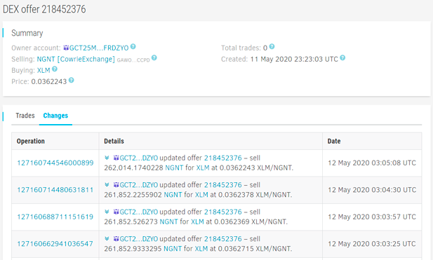
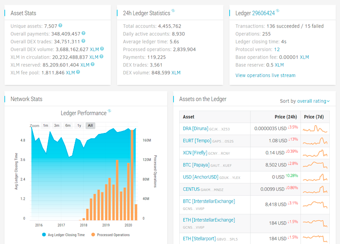
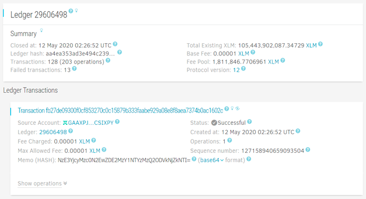
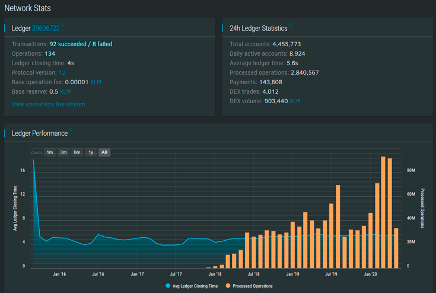
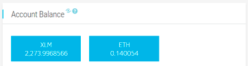
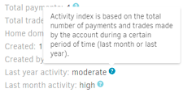
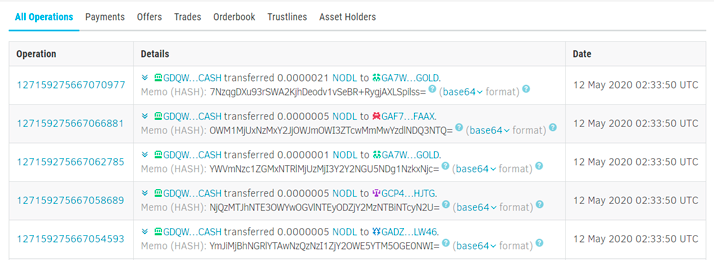
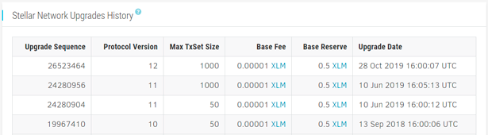
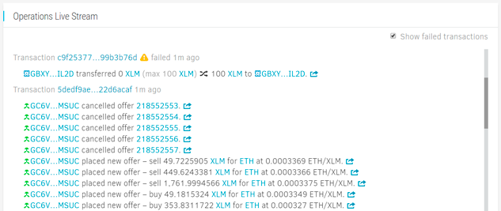

Fresh from the oven – a new breathtaking issue of the world-famous StellarExpert
Updates Magazine!

Well... Maybe not world-famous, but at least well-known in Stellar community.
Strictly speaking, "breathtaking" may sound a little bit exaggerated; let's say
"interesting". Not the right word? Ok, how about "informative?" 

Yeah, you are right, it's just another post about software updates.
For me, all those changes look exciting because of the countless hours spent
on the development. Hence I can talk non-stop about the things barely
noticeable for our users. 
Here is a brief summary of the progress since the previous overview published in
[November 2019](./stellarexpert-update-november-2019).

First of all, a few words about our current priorities. The last two years
were like a roller coaster drive for me since StellarExpert backend and ledger
data ingestion engine has been rebuilt from scratch at least four times, not
counting hundreds of other significant changes. Database, storage formats, API,
data aggregation pipelines – everything was revised several times in attempts
to optimize performance and introduce the foundation for new essential features.

Finally, we have a stable infrastructure and a clear vision of the future road,
as well as apprehension of limitations that we can't overcome (perhaps, the most
valuable information for future planning).

Of course, there is always a room for improvements – we are trying new approaches,
playing with different data storage/aggregation strategies, moving to more robust
hardware. It's a constant trial and error research. Sometimes really painful.
For example, an attempt to implement better filters and sorting for operations
history lists (both account and asset history) failed miserably despite a
tremendous amount of effort spent on this feature. We even released it (twice!),
but had to roll back the changes, remove the corresponding interface fields,
and postpone it for now because the database could not handle filtered
operations search on multiple fields in some edge cases, resulting in degraded
performance across the entire site. It was not a problem earlier as Stellar
pubnet has been significantly smaller, but now with 1 billion operations, we
must invent new strategies for storing and querying Stellar history.
Just a tiny glimpse at the problems we have to deal with.

But this research is extremely important for the evolution of StellarExpert and
other services built on top of it, pushing horizons even further.
For instance, we played a lot with different database engines (Neo4j,
Elasticsearch, Dgraph, ClickHouse) to prepare a foundation for building a full
network graph showing the connections between all four millions accounts from
Stellar pubnet.

Maybe you've heard the recent news about the partnership between
SDF and Elliptic, a provider of the crypto-asset risk management. In simple
words, they offer enterprise tools for detecting and preventing illegal and
criminal operations. The network graph we are building will allow us to create
an advanced system that can help wallets and application to do the same.
This service will be available free of charge for everyone, as I believe that
dealing with illegal activity is very important for a healthy network. Maybe
Stellar is not widely used by drug dealers or terrorists, but we hear new
stories from crypto-scam victims every day. We can make Stellar Network a
safer place by proactively blocking payments to accounts spotted in sending
spam transactions or promoting scam websites, so this looks like a very
promising research direction.

Aside from building new features, our next top priority is user interface
improvement. Now, when we fixed most of the pressing issues, we started to put
more effort into the user interface improvements.

There are even more changes under the hood. Maybe not so obvious, but still very
important for the streamlined user experience and further development process.
We spent a lot of time cleaning the code, updating libraries, optimizing
dependencies. Primary goals:
 
- Make the interface more responsive by cutting down the amount of loaded js/css.
- Revise API resource caching and employ RFC 5861 stale-while-revalidate
technique for API calls.
- Unify UI, navigation, and split everything into loosely connected isolated
components. We've published some reusable modules already, and we'll keep
sharing our codebase with the community. The long-term goal is to make
StellarExpert fully open-source, piece by piece, module by module.

And finally, here is the list of the most notable interface changes and
new functionality.

### Offer details interface
 
DEX offers were the only legder entries that looked neglected.
From now on, you can check all offer details, trades, and
modifications history. The data also includes inactive/removed offers that
cannot be obtained from Horizon API or Core database.
Navigate to any DEX offer using a website search or simply clicking a link
from operations/trades history.



### Reworked explorer home page layout

We added assets general stats and XLM circulation/reserved supply, repositioned
charts, and top assets list.



### Visual blocks 

We display a lot (sometimes maybe even more than enough) of statistics and
network parameters, so we needed a way to unobtrusively group the data,
visually separate content blocks.

The funny thing is, now it is closer to how it looked in the very first version
of StellarExpert back in 2017. A long travel towards the maximum UI simplicity
and back again. 



### Night theme

You asked, and we delivered. Switch between day/night theme using a toggle
button in the footer.



### Enhanced account page

Now StellarExpert shows organization info from `stellar.toml` on the account
page for asset issuers and other accounts referenced in organization TOML file,
like validator addresses, organization's signing key, and all other accounts
listed under the "accounts" sections. This helps to distinguish official
organization accounts from malicious impostors.

Following users' feedback, we decided to highlight current account balances. 



Plus, we added account activity index metric based on the operations count
during the last month/year which allows assessing account dynamic at a glance.



### Inline operation memos

It turns out, that some ecosystem projects extensively use transaction `memo`
field to attach extra information to payments and manage offer operations. So
we followed the advice of Hans from BlueOrion and show memos directly in the
operation history list.



### Fixed protocol changes history

The [protocol changes history](https://stellar.expert/explorer/public/protocol-history)
introduced some time ago had a major flaw. It displayed only those ledgers on
which protocol bumps occurred, so other important adjustments (like base reserve
amount or max transactions per legder changes) were missing there.
We refactored ingestion engine to store all protocol evolutions.



### Operations live stream

You know, Stellar Network is quite a busy place. With hundreds or often even
thousands of operations per minute, tracking recent activity in a user-friendly
way becomes a not-so-trivial technical task. A straightforward streaming of all
operations from Horizon server results in a rapidly flicking interface more
resembling a stroboscope. Also, transactions and operations have to be grouped
together, otherwise the information on the screen will be incomplete.

[Operations live stream](https://stellar.expert/explorer/public/operations-live-stream)
interface shows recent operations on the ledger with the smooth UI that
automatically pauses the stream on scrolling and allows fetching operations
history using infinite scroll.



### Asset rating API endpoint

We opened one more API endpoint – a composite asset rating index. It is backed
by a system of technical indicators based purely on the ledger activity
parameters (like the number of trades, payments, age, volumes). This rating
stats return the same data we show on the asset page. The rating is prone
to manipulations as it is based only on technical parameters. But still, it can
come in handy for wallets and DEX interfaces.

Example:

```
GET https://api.stellar.expert/explorer/public/asset/EURT-GAP5LETOV6YIE62YAM56STDANPRDO7ZFDBGSNHJQIYGGKSMOZAHOOS2S/rating
```

```json
{
  "asset": "EURT-GAP5LETOV6YIE62YAM56STDANPRDO7ZFDBGSNHJQIYGGKSMOZAHOOS2S-1",
  "rating": {
    "age": 10,
    "trades": 5,
    "payments": 7,
    "trustlines": 9,
    "volume7d": 14,
    "interop": 10,
    "average": 9.2
  }
}
```

Read full API description [here](https://github.com/orbitlens/stellar-expert-explorer/blob/master/docs/api/rating.md).
Feel free to use it in your projects.

---

As always, will be happy to hear your feedback and new feature proposals.