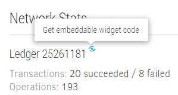
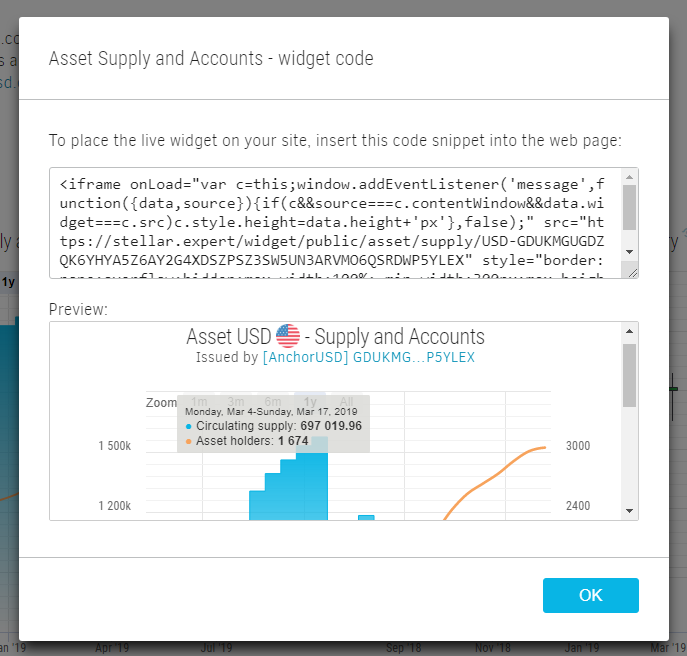
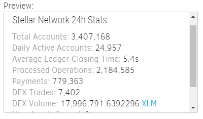
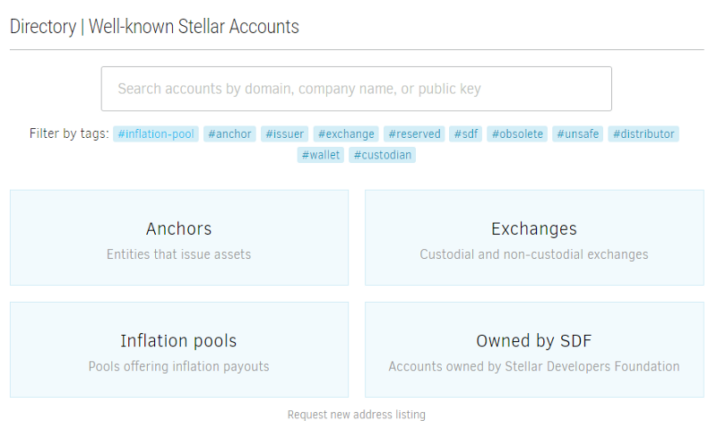
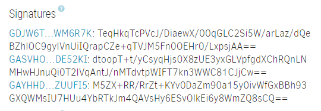
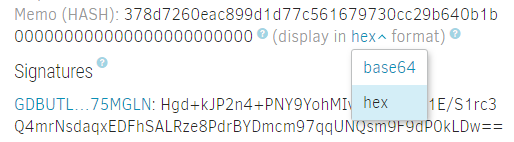
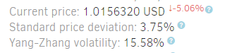

#### Embeddable Widgets

This new functionality allows anyone to embed a chart or stats block from [StellarExpert](https://stellar.expert) with minimum efforts. I believe that all information stored on the ledger should be open and user-friendly as it’s one of the pillars of the truly decentralized platform. Widgets may be quite useful for anchors, companies, individual developers, as well as regular users. Embedded blocks are “live” — they always contain relevant and up-to-date information, not the historical snapshots at a given time.

Do you want to insert your favorite asset’s price history chart or live stellar network stats ticker to your personal blog? Maybe point at the transaction and show all details in the article? Just copy-paste the widget code, and you are all set!

We spent quite a lot of time implementing it, but now almost every single one meaningful content block is available for embedding:

**Network activity page**

*   Latest ledger stats
*   24h statistics
*   Ledger performance chart
*   Accounts chart
*   New assets and trustlines chart
*   Payments and trades chart
*   XLM supply and fee pool chart

**Asset page**

*   Summary
*   Supply and accounts chart
*   Price and volume chart

**Account page**

*   Summary block
*   Current account balances
*   Balance history chart for the particular asset

**Transaction page**

*   The whole transaction block with signatures and operations

Interesting? Try the feature yourself and let us know what do you think. Widgets are free to use for anyone without limitations. Just try not to put more than two widgets on the page because our automated firewall may block your users for sending too many API requests.

#### Account Demolisher

Every Stellar account must maintain a minimum balance (currently 1 XLM) to exist on the ledger. Moreover, each asset trustline, open DEX offer, additional signer, and data entry requires an additional 0.5 XLM reserve. To remove an account and reclaim all stored lumens, one has to remove all offers, trustlines, and data entries first. Centralized exchanges (like Binance and Kraken) do not support direct merge operations, only payments. It means that a person just can’t close the account entirely and reclaim the 1XLM reserve without the help of a third-party account. Sometimes it takes a lot of time and efforts to perform all these operations. For an inexperienced user, it may even become an impossible task.

Our new tool, [Account Demolisher](https://stellar.expert/demolisher/public/), provides a straightforward way to merge Stellar accounts in one click.

*   Automatically closes open offers.
*   Automatically sells owned assets on Stellar DEX at market price.
*   Automatically removes trustlines, returning all unsold assets to the issuers.
*   Automatically removes existing data entries.
*   Allows merging directly to exchanges and other destinations that do not support merge operations out of the box.
*   Works with multisig accounts.
*   Absolutely free, a user pays only for transaction fees.

#### New Directory UI

Our Open Accounts Directory grows steadily — currently it contains more than 150 well-known Stellar addresses. We optimized the navigation and UX with the new categorized start screen, improved search, and cleaner search results grid.

#### Other changes

*   The transaction details page shows not only signatures but also the corresponding signer public keys. This feature is quite handy for developers working with multisig accounts.

*   Advanced memo display with automatic Base64 < > HEX encoding conversion for memo type RETURN and HASH. Stellar stores the binary memo data without format, so it was quite hard to find the specific transaction by memo if it was originally provided in HEX format.

*   New asset price stability indicators: Standard Price Deviation and Yang-Zhang Volatility index. Those parameters allow estimating asset relative price volatility at a glance, which is especially important for stablecoins.

*   All contextual query parameters (filters, sort order, paging, etc.) are saved in the URL query string, which makes sharing information much easier. Now you can point directly at the specific operations history page or, say, assets list sorted by age ([https://stellar.expert/explorer/public/asset?sort=created&order=asc](https://stellar.expert/explorer/public/asset?sort=created&order=asc)).
*   Added support for stellar protocol v11 new operations and XDR changes.
*   Standard time-frames and unified UX across all charts.
*   And a bunch of other minor improvements.

Also, we are building a new “Markets” interface resembling [StellarX Markets page](https://www.stellarx.com/markets) that will contain extensive information about active DEX markets. Our new bot that fetches and processes accounts TOML files will also provide autodiscovery for the Stellar-compatible services like Anchor Info ([SEP-0006](https://github.com/stellar/stellar-protocol/blob/master/ecosystem/sep-0006.md)), Federation ([SEP-0002](https://github.com/stellar/stellar-protocol/blob/master/ecosystem/sep-0002.md)), Compliance ([SEP-0003](https://github.com/stellar/stellar-protocol/blob/master/ecosystem/sep-0003.md)), Approval Server for Regulated Assets ([SEP-0008](https://github.com/stellar/stellar-protocol/blob/master/ecosystem/sep-0008.md)), Anchor KYC Info Transfer ([SEP-0012](https://github.com/stellar/stellar-protocol/blob/master/ecosystem/sep-0012.md)), Validator Self-Verification ([SEP-0020](https://github.com/stellar/stellar-protocol/blob/master/ecosystem/sep-0020.md)). Please let me know if we missed something and you want to request additional data aggregation or have ideas about better UI for the upcoming markets interface.