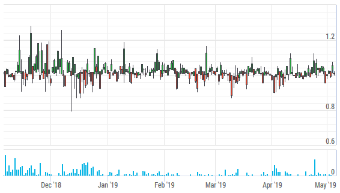
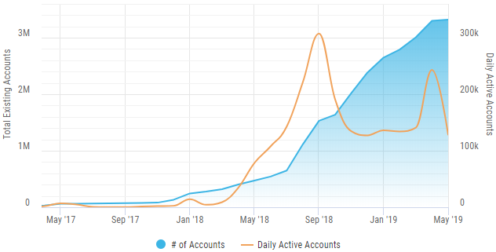
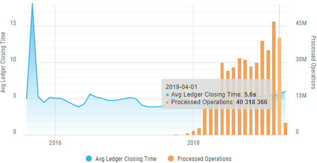
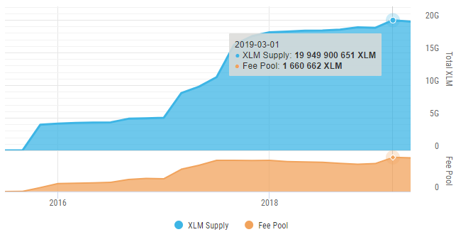
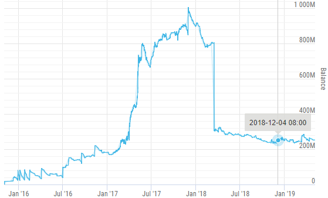
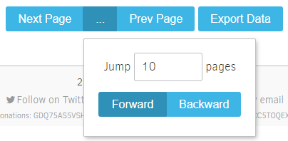
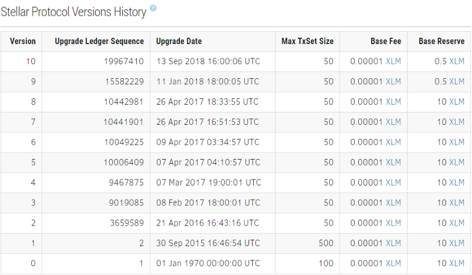

It has been a long time since I last published the updates about my progress with StellarExpert. Mainly because the last few months of the meticulous and sometimes really boring work were directed on the low-level things, the groundwork for the new functionality. However, now the release is ready, and I can finally share the details with the community.

First of all, I’m thrilled to announce that our team is growing. Until recently, I was running StellarExpert all by myself. But thanks to the new Stellar Developer Program grant I have enough funds to expand the crew, inviting full-time professionals. [/u/hawthorne1962](https://www.reddit.com/u/hawthorne1962), a full-stack JS developer, joined StellartExpert a month ago, and we have also signed one more developer and project manager. I’m confident that with our incredible new team we’ll be able to enhance the quality and variety of our services.

Back to StellarExpert, here is the [new beta version](https://preview.stellar.expert/). It still has some flaws, and we are actively fixing minor issues. That’s why this release will reside on the separate domain for a few more days to make sure that everything works like a charm, and our new DDoS protection service doesn’t block regular users.

The most important changes:

*   No more aggregation delays. People often asked, why the account/asset information has been updated about once in 5 minutes. The lag was caused by the history archives concept itself. The archives were designed to be updated once in 64 ledgers (about 5 minutes), and until recently there were no way to calculate consistent information about the account balance. But thanks to Stellar Horizon team we can now query information about failed transactions. This feature allowed us to change the ingestion behavior, so account/assets stats are updated almost immediately (a few seconds after the ledger is closed).
*   We integrated [CoinGecko](https://www.coingecko.com)’s XLM/USD exchange rates feed. All asset prices are displayed in USD instead of XLM by default. Other fiat currencies (EUR, JPY, etc.) are on the way. This feature looks particularly impressive with stablecoins, for instance, check the historical price of [AnchorUSD](https://preview.stellar.expert/explorer/public/asset/USD-GDUKMGUGDZQK6YHYA5Z6AY2G4XDSZPSZ3SW5UN3ARVMO6QSRDWP5YLEX).

*   New metrics: network “daily active accounts”, and “authorized trustlines” for assets.

*   New [network stats dashboard](https://preview.stellar.expert/explorer/public/network-activity) with extra information and new charts, including ledger performance (average ledger closing time and total process operations), daily active accounts, XLM supply & fee pool size.

*   Fine-grained historical statistics with 1-hour timeframes for accounts and assets data. The 24h timeframe currently used for statistics does not provide enough information, especially in the case of an asset price or account balance.

*   New paging for all data grids. I received dozens of emails regarding the paging mechanism in all data grids (operation history, trades history, assets list). After a series of failed experiments, we found a compromise solution that allows fast navigation (the ability to “jump” N pages forward/backward) and at the same time does not have a severe database performance impact.

*   [Protocol versions history](https://preview.stellar.expert/explorer/public/protocol-history). Most Stellar fans don’t know anything about the protocol versioning. Meanwhile, Stellar mainnet underwent ten protocol upgrades. Each upgrade is essentially equal to the “hardfork” term from the BTC/ETH world. The fact that most users didn’t even notice the upgrades is the best compliment to the SCP protocol and network validators.

*   A lot of UI/UX improvements: better data grouping and zooming in charts, responsive tables for mobile browsers, unified visual styles, lightweight components, much smaller js/css bundles.
*   Again, thanks to the grant from SDF, we migrated to new dedicated servers with 256 GB RAM each and set up [StackPath](https://www.stackpath.com/) CDN & DDoS protection.

Our next primary goal is to implement interactive widgets, that can be embedded into any website, and open API price tickers for Stellar assets. We prepared the infrastructure that will be able to handle millions of page views, so we are finally ready to make the next step in this direction.

I will be really grateful if you could spare a few minutes to check [new StellarExpert](https://preview.stellar.expert/) [beta](https://preview.stellar.expert/) and let me know if you find any issues.