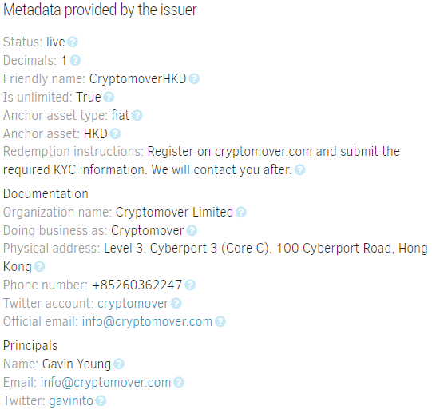
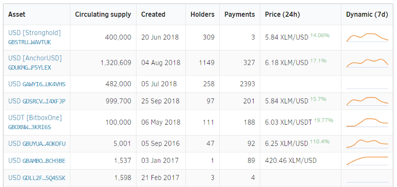
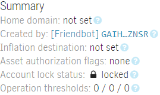
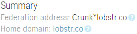
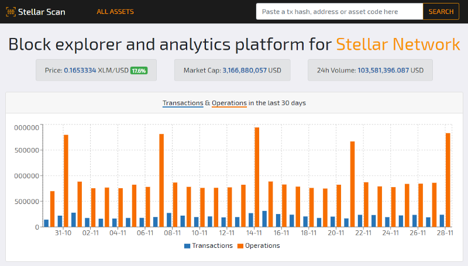

November is almost over, and it was a tough month for blockchain projects. "Bear market continues " – such simple words filled hearts of the HODLers with doubt and dismay, and suddenly neither of them is 100% sure about that whitepaper which seemed so cool and revolutionary only a few months ago. Only those who really believe in the technology keep working on their projects despite all the news. So let the traders trade, and focus on the development. Let’s see what’s new in [StellarExpert](https://stellar.expert) since [the last update](https://galactictalk.org/d/1688-stellarexpert-new-features-and-public-directory-api).

## Extended Asset Information

[SEP-0001](https://github.com/stellar/stellar-protocol/blob/master/ecosystem/sep-0001.md) was recently updated to expand the information provided by anchors, including organization official docs and principals behind the anchor. Extended information is available on the Asset page.

## Search by Asset Code

Don’t remember what exactly the name of that asset was? Use searchbox to find it.

## Account Page Improvements

Now you can easily check the 🔒 locked status and authorization flags of any account. The account is considered locked if the total weight of all signers is lower than its medium threshold, or it has only one signer with the master weight set to 0. Want to know who created the account without digging through the operations? The creator account is displayed in "Summary" section.

## Better Federation Support

If account "home\_domain" supports Federation protocol with reverse lookup, account summary shows corresponding federation name. Federation names are also supported in search-box, "Find Payment" interface, and Payment Locator API.

## Separate "Manage Offers" and "Trades" operation history tabs

"Manage Offers" tab displays MANAGE\_OFFER and CREATE\_PASSIVE\_OFFER operations while "Trades" tab contains only actual trades that happened on chain.

…and a bunch of other tiny fixes and improvements.

More great new features are coming soon, so stay tuned. And [let me know](https://github.com/orbitlens/stellar-expert-explorer/issues) if you spot a bug in StellarExpert or have any ideas how to make it better.

P.S. Stumbled upon [this site](https://stellscan.pro/) yesterday.

I guess, it means that I’m doing everything right, however you guys really need to read "[Steal Like An Artist](https://austinkleon.com/steal/)" by Austin Kleon. Feel free to use the ideas, but at least change headers on the home page 😉