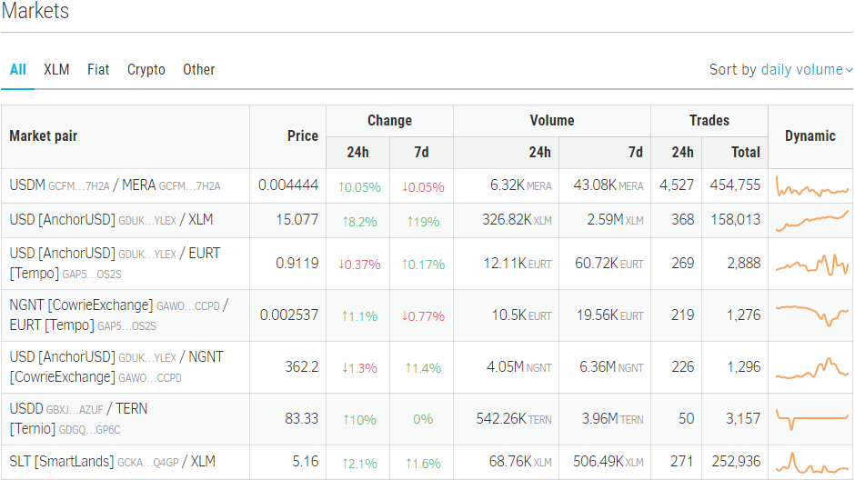
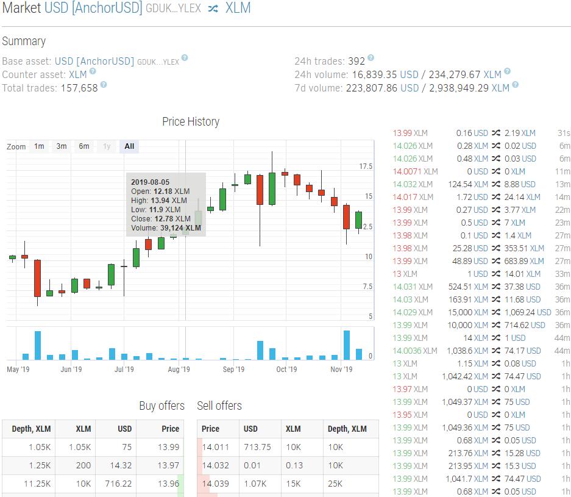
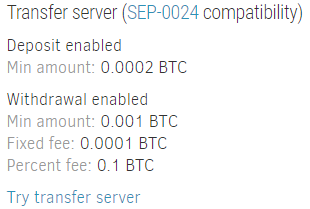
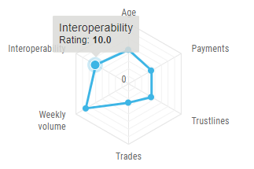
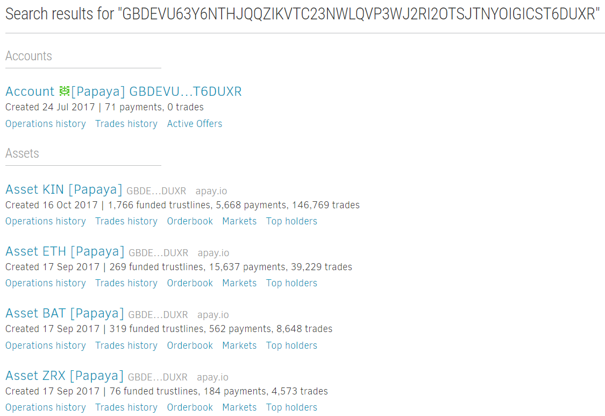

We are happy to announce that we are launching our blog at 
[https://stellar.expert/blog](https://stellar.expert/blog) ✨✨✨  
I used to publish our updates on Medium and share the links across
Stellar-related media (including Reddit, Twitter, GalacticTalk), but recent
Medium content policy changes and tricks focused on maximizing the profitability
through paid subscriptions put a wall between users and information that
supposed to be free and available without limitations. Hence we decided to start
our own blog and move old posts here. It has only basic functionality
(right what we need presently), but we are planning to add a comments module as
well as some other usability improvements later. 

That's not the only change since my previous post...

--- 

### Markets dashboard

First of all, the brand new
Stellar [markets dashboard](https://stellar.expert/explorer/public/market) is 
here! That's not something completely new – StellarX, StellarPort, 
InterstellarExchange, and other applications had a similar interface from 
day one. The key difference in our implementation is that we aggregate 
statistics for **all** Stellar markets, not only for "listed" tokens.
Remember selling BEER for XLM back in 2018? [We do](https://stellar.expert/explorer/public/market/BEER-GDW3CNKSP5AOTDQ2YCKNGC6L65CE4JDX3JS5BV427OB54HCF2J4PUEVG-1/XLM) 😉  

The market dashboard shows price with daily and weekly dynamics, volumes and
trades count. Users can sort data by daily volume, trades count, market age
(determined on the first trade recorded on the ledger) and filter by anchored
asset types – fiat-anchored, crypto-anchored, XLM-based markets. 

Orderbook, price charts, trades feed – standard exchange toolkit also present 
on the market details page.

### Total/funded/authorized trustlines for assets

To provide more info on an actual number of accounts that hold specific tokens,
we started tracking statistics for established, funded, and authorized
trustlines separately.

### Extended SEP information from stellar.toml 

Stellar ecosystem is moving towards the more standardized wallet-anchor
interoperability, so we invested a lot of time and effort to gather and process
assets metadata from stellar.toml according to the
[SEP-3](https://github.com/stellar/stellar-protocol/blob/master/ecosystem/sep-0003.md), [SEP-10](https://github.com/stellar/stellar-protocol/blob/master/ecosystem/sep-0010.md), [SEP-12](https://github.com/stellar/stellar-protocol/blob/master/ecosystem/sep-0012.md), and [SEP-24](https://github.com/stellar/stellar-protocol/blob/master/ecosystem/sep-0024.md) standards.
Well, such information will be interesting mainly for developers, but still,
we aimed to display it in the clearest way possible.

Transfer server info (SEP-24 standard) is now available directly from
the asset page.  It's possible to set up and [test](http://sep24.stellar.org/#HOME_DOMAIN=%22apay.io%22&TRANSFER_SERVER=%22https://api.apay.io/api%22&WEB_AUTH_ENDPOINT=%22%22&USER_SK=%22%22&HORIZON_URL=%22https://horizon.stellar.org%22&ASSET_CODE=%22BTC%22&ASSET_ISSUER=%22GAUTUYY2THLF7SGITDFMXJVYH3LHDSMGEAKSBU267M2K7A3W543CKUEF%22&EMAIL_ADDRESS=%22%22&AUTO_ADVANCE=true&PUBNET=true) the automatic transfer for
assets (of course, only for those that support SEP-24 standard) right from
the TOML info section. 

### Interoperability score

Since the automatic interaction is essentially one of the main drivers of the
harmonic ecosystem growth, we changed the way how we calculate assets ratings,
adding the new "Interoperability" category. 
Assets without a stellar.toml receive only 1 grade in this category.
An asset with a correct stellar.toml and filled in organization info has
4 points from the start. If the parser detects a valid SEP-24 transfer server,
it adds 4 points. Implemented SEP-3, SEP-10, or SEP12 add 2 more points to the score.

### New search engine

The next essential change is a completely reworked search engine implementation
with full-text search capabilities. For instance, you'll be able to search for
assets by domain, description from stellar.toml, asset code, anchored asset
type, etc. 
It works more like Google now – found items with a basic description are
displayed on the search results page according to the relevance.
You can search for anything – asset code, domain, keywords in asset
TOML description, anchored asset name, etc. To search for assets having specific
features implemented, try to type "sep3", "SEP-24", or "TRANSFER_SERVER".

To make it even better we are also planning to show payments with a relevant
memo, asset, or source/destination address. Of course, old good search by 
ledgers, accounts, operations, transactions is still there. 

I'm especially inspired with this new search engine functionality – querying
structured information from the ledger using human-friendly natural text search
is an ultimate goal for any blockchain explorer.
We keep polishing and experimenting with it, so who knows, maybe we'll be able
to introduce a completely new user experience in the nearest future.

### Open asset supply API

Recently I received a feature request from Glitzkoin to share total GTN asset
supply stats displayed on StellarExpert. Aggregator platforms like CoinMarketCap
and Coingecko require an API endpoint to track total asset supply automatically.
Building a unified open API endpoint for exactly that purpose struck me as
a good idea, and we implemented it right away. 

If you need such information for listing your token somewhere, 
feel free to use our `/explorer/public/asset/{asset}/supply` endpoint. 
It's completely free and has CORS headers enabled, so you can use it straight
on your own website. Check the complete description [here](https://github.com/orbitlens/stellar-expert-explorer/blob/master/docs/api/supply.md).

### No-referrer headers

Personal privacy is especially important when we are talking about finances.
We value your privacy, therefore we don't use behavioral analytics tools like
Google Analytics and don't track IP addresses server-side. A month ago we also
added the no-referrer content policy to all StellarExpert pages in order to
prevent sending additional referrer information along with requests.
This protects the user's browsing history when she navigates to, say,
an anchor website.

### Identicons
 
And a cherry on a pie. We adopted an awesome identicons standard proposed by
Lobstr team. It helps visually distinguish various accounts at a glance,
especially on pages containing multiple operations.

---

As a closing note, special thanks to Tom Quisel, Tomer Weller, Gleb Pitsevich,
Dmitri Gmyza, and Justin Rice for providing awesome feedback as well as
inspiration for new features.