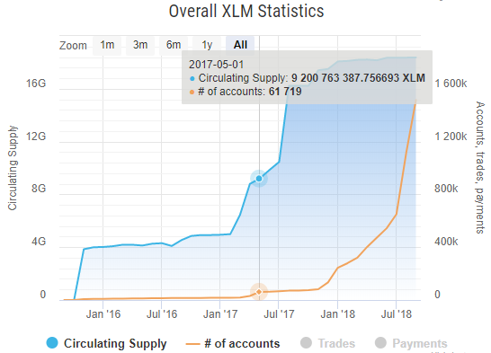
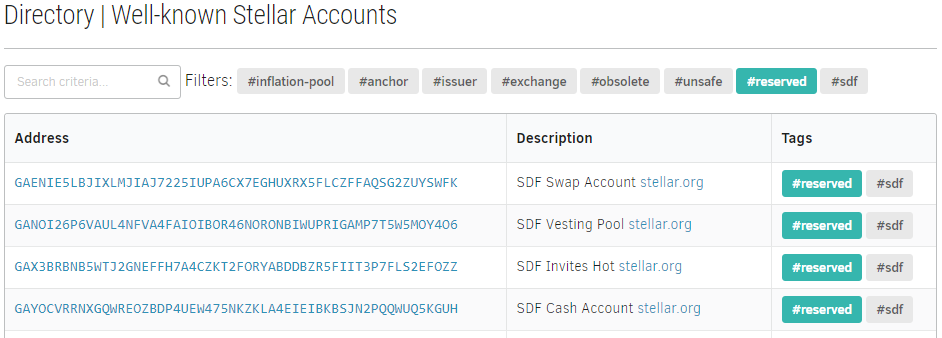

Fresh [StellarExpert](https://stellar.expert) release is deployed, and I'd like
to share some info about new features implemented since previous major release.

* XLM supply chart shows the circulating amount and its changes over time.

* Open [Directory API](https://github.com/orbitlens/stellar-expert-explorer/blob/master/docs/api/directory.md)
for developers. Use a curated list of well-known account addresses in your
application.
* New [Directory explorer](https://stellar.expert/explorer/public/directory) interface.

* All dates displayed in UTC format, no more problems with local browser
timezone conversions.
* Multiple minor bugs fixed, performance improved. The explorer and ingestion
engine are now stable.

Special thanks to @irisli, who maintained the original Stellar directory.